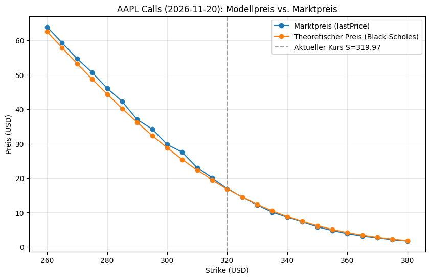
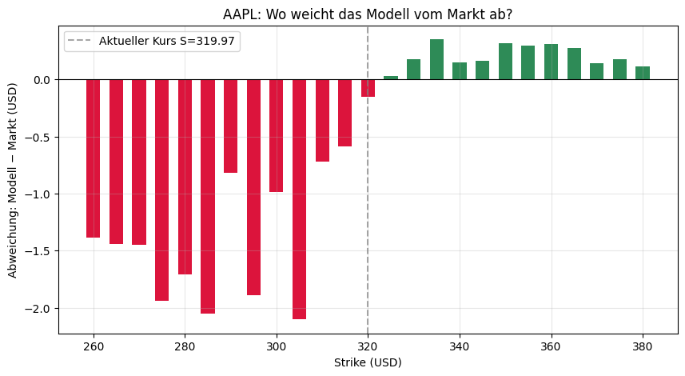

# Fair-Value-Rechner für Optionen (Black-Scholes)

Kleines Projekt zur Bewerbung als Trading Trainee bei der Börse Stuttgart.

## Ziel
Berechnung des theoretischen Fair Value von Optionen mit dem Black-Scholes-Modell 
und Vergleich mit echten Marktpreisen, um Über-/Unterbewertungen sichtbar zu machen.

## Methodik
- Historische Kursdaten (Apple-Aktie) über yfinance geladen
- Volatilität aus den Kursdaten selbst berechnet (annualisiert: ~27,5%)
- Black-Scholes-Formel in Python selbst implementiert
- Vergleich mit echten Call-Optionspreisen (Verfall 2026-11-20)

## Ergebnisse
Nahe am aktuellen Aktienkurs liegt das Modell sehr nah am Marktpreis (Abweichung 
teils unter 20 Cent). Bei tief-im-Geld-Optionen wächst die Abweichung auf bis zu 
~2 USD – vermutlich bedingt durch veraltete Preisdaten im kostenlosen Datenfeed, 
nicht durch einen echten Markteffekt (erkennbar an unrealistisch niedrigen 
impliziten Volatilitäten in den Rohdaten).

## Learnings
Ein Modell ist nur so gut wie die Daten, die man reinsteckt – Ergebnisse sollte 
man immer kritisch hinterfragen statt sie einfach zu glauben. Als nächsten Schritt 
könnte man einen Live-Datenfeed und eine variable Volatilität pro Strike einbauen.

## Vollständiges Notebook
[option_pricer_euwax.ipynb](./option_pricer.ipynb)

---
**Autor:** Kyle Zieher
